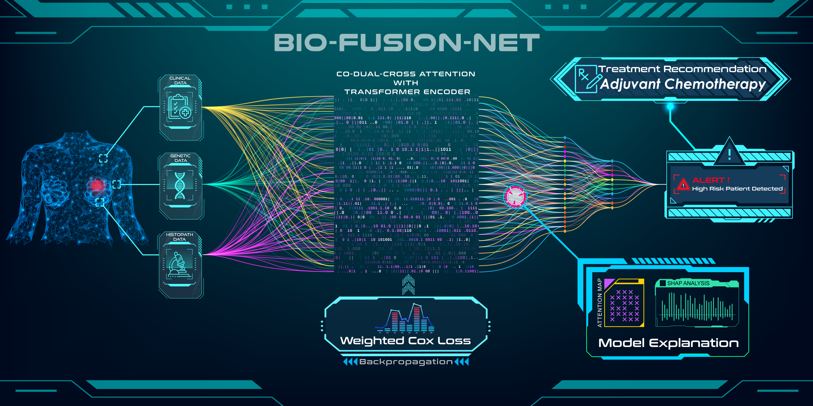

# BioFusionNet: Survival Risk Stratification through Multi-Feature and Multi-Modal Data Fusion [[Paper](https://ieeexplore.ieee.org/document/10568932)]


 <!-- If you have a logo or relevant image -->


## Features

- **Multimodal Integration**: BioFusionNet expertly integrates histopathological, genetic, and clinical data using advanced deep learning techniques, ensuring a comprehensive analysis of ER+ breast cancer patient profiles for precise survival risk stratification.

- **Sophisticated Feature Fusion with Attention Mechanism**: Employs state-of-the-art self-supervised feature extractors and a novel co dual cross-attention mechanism, coupled with a Variational Autoencoder, to selectively emphasize the most pertinent features across multiple modalities, enhancing the predictive accuracy.

- **Tailored for Imbalanced Survival Data**: Features a specialized weighted Cox loss function designed to adeptly handle the intricacies of imbalanced survival datasets, significantly elevating the model's effectiveness in predicting time-to-event outcomes with superior performance metrics.


## Table of Contents

- [Features](#features)
- [Installation](#installation)
- [Dataset](#dataset)
- [Results](#results)
- [Explainability](#explainability)


## Installation
First Install Required Libraries
```bash
pip install -r requirements.txt
```
## Extracting Image Features
```bash
python extract_image_features.py --root_dir ./sample_dataset/sample_image_data_structure/ --model_name DINO33M
```
## Training VAE
```bash
python training_VAE.py --train_file sample_dataset/train_patient_id.txt \
               --val_file sample_dataset/test_patient_id.txt \
               --batch_size 16 \
               --learning_rate 0.001 \
               --epochs 100 \
               --patience 5 \
               --save_dir /sample_dataset/sample_VAE_Extracted_Features/

```
## Training Risk Model
```bash
python train_risk_model.py \
  --train_data_txt sample_dataset/train_patient_id.txt \
  --test_data_txt sample_dataset/test_patient_id.txt \
  --survival_data sample_dataset/survival_data.csv \
  --gene_expression_data sample_dataset/gene_expression.csv \
  --clinical_data sample_dataset/clinical_data.csv \
  --features_dir /sample_dataset/sample_VAE_Extracted_Features/
```

## Save Prediction
```bash
python main.py \
  --train_data_txt /sample_dataset/train_patient_id.txt \
  --test_data_txt /sample_dataset/test_patient_id.txt \
  --survival_data /sample_dataset/survival_data.csv \
  --gene_expression_data /sample_dataset/gene_expression.csv \
  --clinical_data /sample_dataset/clinical_data.csv \
  --features_dir /sample_dataset/sample_VAE_Extracted_Features \
  --model_path /path/to/cv_1_mocov3.pt \
  --feat_out 128

```
## Explainability 
### Shap Analysis for Genetic Features
```bash
python shap_analysis.py --analysis_type gene --list_path /sample_dataset/gene_expression.csv 
```
### Shap Analysis for Clinical Features
```bash
python shap_analysis.py --analysis_type clinical --list_path /sample_dataset/clinical_data.csv
```

## Proposed Loss Function
```python
def loss_fn(risks, times, events, weights):
    """
    Calculate the Cox proportional hazards loss with weights for imbalance.

    Parameters:
    - risks: Tensor of predicted risk scores (log hazard ratio) from the model.
    - events: Tensor of event indicators (1 if event occurred, 0 for censored).
    - weights: Tensor of weights for each sample.

    Returns:
    - Calculated loss.
    
    """
    

    risks = risks.to(device)
    events = events.to(device)
    weights = weights.to(device)
    
    
    events = events.view(-1)
    risks = risks.view(-1)
    weights = weights.view(-1)
    

    total_weighted_events = torch.sum(weights * events)

    # Sort by risk score
    order = torch.argsort(risks, descending=True)
    risks = risks[order]
    events = events[order]
    weights = weights[order]

    # Calculate the risk set for each time
    hazard_ratio = torch.exp(risks)
    weighted_cumulative_hazard = torch.cumsum(weights * hazard_ratio, dim=0)
    log_risk = torch.log(weighted_cumulative_hazard)
    uncensored_likelihood = weights * (risks - log_risk)

    # Only consider uncensored events
    censored_likelihood = uncensored_likelihood * events
    neg_likelihood = -torch.sum(censored_likelihood) / total_weighted_events

    return neg_likelihood
```

## Survival Curve
### Step1:
```bash
python km_survival_curve_step_1.py --data_file "/sample_dataset/clinical_data.csv" --train_id_template "path/to/cv{}_train_patient_id.txt" --test_id_template "path/to/cv{}_test_patient_id.txt" --training_data_predictions_template "path/to/cv{}_training_data_predictions.txt" --test_data_predictions_template "path/to/cv{}_test_data_predictions.txt" --output_folder "path/to/output_folder" --num_folds 5
```
Use the data generated from Step 1: combined_extracted_data.csv
### Step2:
```bash
python km_survival_curve_step_2.py --data_file "/sample_dataset/combined_extracted_data.csv" --output_file "path/to/output_plot.png"
```
## Hazard Analysis
### Multivariate Analysis
```bash
python hazard_analysis.py --data_file "sample_dataset/curated_survival_for_hazard.csv" --columns "TIME,EVENT,Grade,Tumor_Size,Age,LN_Status,Subtype,Risk Group" --output_file "path/to/output_plot.png"
```
### Univariate Analysis
```bash
python hazard_analysis.py --data_file "sample_dataset/curated_survival_for_hazard.csv" --columns "TIME,EVENT,Risk Group" --output_file "path/to/output_plot.png"
```
## Dataset

The following data sources have been used in this project:

- Genetic Data:
  - [BRCA TCGA](http://www.cbioportal.org/study/summary?id=brca_tcga)
  - [BRCA TCGA Pub2015](http://www.cbioportal.org/study/summary?id=brca_tcga_pub2015)
- Diagnostic Slide (DS): [GDC Data Portal](https://portal.gdc.cancer.gov/)
- DS Download Guideline: [Download TCGA Digital Pathology Images (FFPE)](http://www.andrewjanowczyk.com/download-tcga-digital-pathology-images-ffpe/)

### Annotation and Patch Creation

- [Qupath Guideline](https://github.com/raktim-mondol/qu-path)

### Image Color Normalization

- Python implementation: [Normalizing H&E Images](https://github.com/bnsreenu/python_for_microscopists/blob/master/122_normalizing_HnE_images.py)

- Actual Matlab implementation: [Staining Normalization](https://github.com/mitkovetta/staining-normalization/blob/master/normalizeStaining.m)

- Reference: [Macenko et al. (2009) - A method for normalizing histology slides for quantitative analysis](http://wwwx.cs.unc.edu/~mn/sites/default/files/macenko2009.pdf)

## Results
### BioFusionNet using Kaplan–Meier curve Survival curves


